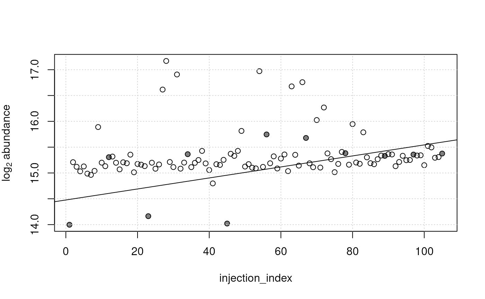

# Core Utils for Metabolomics Data

**Package**:
*[MetaboCoreUtils](https://bioconductor.org/packages/3.23/MetaboCoreUtils)*\
**Authors**: Johannes Rainer \[aut, cre\] (ORCID:
<https://orcid.org/0000-0002-6977-7147>), Michael Witting \[aut\]
(ORCID: <https://orcid.org/0000-0002-1462-4426>), Andrea Vicini \[aut\],
Liesa Salzer \[ctb\] (ORCID: <https://orcid.org/0000-0003-0761-0656>),
Sebastian Gibb \[aut\] (ORCID: <https://orcid.org/0000-0001-7406-4443>),
Michael Stravs \[ctb\] (ORCID: <https://orcid.org/0000-0002-1426-8572>),
Roger Gine \[aut\] (ORCID: <https://orcid.org/0000-0003-0288-9619>),
William Kumler \[aut\] (ORCID: <https://orcid.org/0000-0002-5022-8009>),
Philippine Louail \[aut\] (ORCID:
<https://orcid.org/0009-0007-5429-6846>)\
**Last modified:** 2026-02-10 10:06:12.135993\
**Compiled**: Tue Feb 10 10:11:59 2026

## Introduction

The
*[MetaboCoreUtils](https://bioconductor.org/packages/3.23/MetaboCoreUtils)*
package defines metabolomics-related core functionality provided as
low-level functions to allow a data structure-independent usage across
various R packages (Rainer et al. 2022). This includes functions to
calculate between ion (adduct) and compound mass-to-charge ratios and
masses or functions to work with chemical formulas. The package provides
also a set of adduct definitions and information on some commercially
available internal standard mixes commonly used in MS experiments.

For a full list of function, see

``` r

library("MetaboCoreUtils")
ls(pos = "package:MetaboCoreUtils")
```

    ##  [1] "addElements"                "adductFormula"             
    ##  [3] "adductNames"                "adducts"                   
    ##  [5] "adjust_lm"                  "betaValues"                
    ##  [7] "calculateKm"                "calculateKmd"              
    ##  [9] "calculateMass"              "calculateRkmd"             
    ## [11] "containsElements"           "convertMtime"              
    ## [13] "correctRindex"              "countElements"             
    ## [15] "fit_lm"                     "formula2mz"                
    ## [17] "indexRtime"                 "internalStandardMixNames"  
    ## [19] "internalStandards"          "isotopicSubstitutionMatrix"
    ## [21] "isotopologues"              "isRkmd"                    
    ## [23] "mass2mz"                    "mclosest"                  
    ## [25] "multiplyElements"           "mz2mass"                   
    ## [27] "pasteElements"              "percentMissing"            
    ## [29] "rowBlank"                   "rowDratio"                 
    ## [31] "rowPercentMissing"          "rowRsd"                    
    ## [33] "rsd"                        "standardizeFormula"        
    ## [35] "subtractElements"

or the [reference
page](https://rformassspectrometry.github.io/MetaboCoreUtils/reference/index.html)
on the package webpage.

## Installation

The package can be installed with the `BiocManager` package. To install
`BiocManager` use `install.packages("BiocManager")` and, after that,
`BiocManager::install("MetaboCoreUtils")` to install this package.

## Examples

The functions defined in this package utilise basic classes with the aim
of being reused in packages that provide a more formal, high-level
interface.

The examples below demonstrate the basic usage of the functions from the
package.

``` r

library(MetaboCoreUtils)
```

### Conversion between ion m/z and compound masses

The
[`mass2mz()`](https://rformassspectrometry.github.io/MetaboCoreUtils/reference/mass2mz.md)
and
[`mz2mass()`](https://rformassspectrometry.github.io/MetaboCoreUtils/reference/mz2mass.md)
functions allow to convert between compound masses and ion (adduct)
mass-to-charge ratios (m/z). The *MetaboCoreUtils* package provides
definitions of common ion adducts generated by electrospray ionization
(ESI). These can be listed with the
[`adductNames()`](https://rformassspectrometry.github.io/MetaboCoreUtils/reference/adductNames.md)
function.

``` r

adductNames()
```

    ##  [1] "[M+3H]3+"          "[M+2H+Na]3+"       "[M+H+Na2]3+"      
    ##  [4] "[M+Na3]3+"         "[M+2H]2+"          "[M+H+NH4]2+"      
    ##  [7] "[M+H+K]2+"         "[M+H+Na]2+"        "[M+C2H3N+2H]2+"   
    ## [10] "[M+2Na]2+"         "[M+C4H6N2+2H]2+"   "[M+C6H9N3+2H]2+"  
    ## [13] "[M+H]+"            "[M+Li]+"           "[M+2Li-H]+"       
    ## [16] "[M+NH4]+"          "[M+H2O+H]+"        "[M+Na]+"          
    ## [19] "[M+CH4O+H]+"       "[M+K]+"            "[M+C2H3N+H]+"     
    ## [22] "[M+2Na-H]+"        "[M+C3H8O+H]+"      "[M+C2H3N+Na]+"    
    ## [25] "[M+2K-H]+"         "[M+C2H6OS+H]+"     "[M+C4H6N2+H]+"    
    ## [28] "[2M+H]+"           "[2M+NH4]+"         "[2M+Na]+"         
    ## [31] "[2M+K]+"           "[2M+C2H3N+H]+"     "[2M+C2H3N+Na]+"   
    ## [34] "[3M+H]+"           "[M+H-NH3]+"        "[M+H-H2O]+"       
    ## [37] "[M+H-Hexose-H2O]+" "[M+H-H4O2]+"       "[M+H-CH2O2]+"     
    ## [40] "[M]+"

With that we can use the
[`mass2mz()`](https://rformassspectrometry.github.io/MetaboCoreUtils/reference/mass2mz.md)
function to calculate the m/z for a set of compounds assuming the
generation of certain ions. In the example below we define masses for
some theoretical compounds and calculate their expected m/z assuming
that ions `"[M+H]+"` and `"[M+Na]+"` are generated.

``` r

masses <- c(123, 842, 324)
mass2mz(masses, adduct = c("[M+H]+", "[M+Na]+"))
```

    ##        [M+H]+  [M+Na]+
    ## [1,] 124.0073 145.9892
    ## [2,] 843.0073 864.9892
    ## [3,] 325.0073 346.9892

As a result we get a `matrix` with each row representing one compound
and each column the m/z for one of the defined adducts. With the
[`mz2mass()`](https://rformassspectrometry.github.io/MetaboCoreUtils/reference/mz2mass.md)
function we could perform the reverse calculation, i.e. from m/z to
compound masses.

In addition, it is possible to calculate m/z values from chemical
formulas with the
[`formula2mz()`](https://rformassspectrometry.github.io/MetaboCoreUtils/reference/formula2mz.md)
function. Below we calculate the m/z values for `[M+H]+` and `[M+Na]+`
adducts from the chemical formulas of glucose and caffeine.

``` r

formula2mz(c("C6H12O6", "C8H10N4O2"), adduct = c("[M+H]+", "[M+Na]+"))
```

    ##             [M+H]+  [M+Na]+
    ## C6H12O6   181.0707 203.0526
    ## C8H10N4O2 195.0877 217.0696

### Working with chemical formulas

The lack of consistency in the format in which chemical formulas are
written poses a big problem comparing formulas coming from different
resources. The *MetaboCoreUtils* package provides functions to
*standardize* formulas as well as combine formulas or substract elements
from formulas. Below we use an artificial example to show this
functionality. First we standardize a chemical formula with the
[`standardizeFormula()`](https://rformassspectrometry.github.io/MetaboCoreUtils/reference/standardizeFormula.md)
function.

``` r

frml <- "Na3C4"
frml <- standardizeFormula(frml)
frml
```

    ##   Na3C4 
    ## "C4Na3"

Next we add `"H2O"` to the formula using the
[`addElements()`](https://rformassspectrometry.github.io/MetaboCoreUtils/reference/addElements.md)
function.

``` r

frml <- addElements(frml, "H2O")
frml
```

    ## [1] "C4H2ONa3"

We can also substract elements with the
[`subtractElements()`](https://rformassspectrometry.github.io/MetaboCoreUtils/reference/subtractElements.md)
function:

``` r

frml <- subtractElements(frml, "H")
frml
```

    ## [1] "C4HONa3"

Chemical formulas could also be multiplied with a scalar using the
[`multiplyElements()`](https://rformassspectrometry.github.io/MetaboCoreUtils/reference/multiplyElements.md)
function. The counts for individual elements in a chemical formula can
be calculated with the
[`countElements()`](https://rformassspectrometry.github.io/MetaboCoreUtils/reference/countElements.md)
function.

``` r

countElements(frml)
```

    ## $C4HONa3
    ##  C  H  O Na 
    ##  4  1  1  3

The function
[`adductFormula()`](https://rformassspectrometry.github.io/MetaboCoreUtils/reference/adductFormula.md)
allows in addition to create chemical formulas of specific adducts of
compounds. Below we create chemical formulas for `[M+H]+` and `[M+Na]+`
adducts for glucose and caffeine.

``` r

adductFormula(c("C6H12O6", "C8H10N4O2"), adduct = c("[M+H]+", "[M+Na]+"))
```

    ##           [M+H]+         [M+Na]+         
    ## C6H12O6   "[C6H13O6]+"   "[C6H12O6Na]+"  
    ## C8H10N4O2 "[C8H11N4O2]+" "[C8H10N4O2Na]+"

Finally,
[`calculateMass()`](https://rformassspectrometry.github.io/MetaboCoreUtils/reference/calculateMass.md)
can be used to calculate the (exact) mass for a given chemical formula.
This function supports also the definition of isotopes in the formula.
As an example we calculate below the mass of two chemical formulas, one
without isotopes and one with 3 of the carbon atoms replaced by the
carbon 13 isotope.

``` r

calculateMass(c("C6H12O6", "[13C3]C3H12O6"))
```

    ##       C6H12O6 [13C3]C3H12O6 
    ##      180.0634      183.0735

Note that isotopes are supported for all elements (deuterium could for
example be expressed as `"[2H]"`).

### Kendrick mass defect calculation

Lipids and other homologous series based on fatty acyls can be found in
data by using Kendrick mass defects (KMD) or referenced kendrick mass
defects (RKMD). The *MetaboCoreUtils* package provides functions to
calculate everything around Kendrick mass defects. The following example
calculates the KMD and RKMD for three lipids (PC(16:0/18:1(9Z)),
PC(16:0/18:0), PS(16:0/18:1(9Z))) and checks, if they fit the RKMD of
PCs detected as \[M+H\]+ adducts.

``` r

lipid_masses <- c(760.5851, 762.6007, 762.5280)
calculateKmd(lipid_masses)
```

    ## [1] 0.7358239 0.7491732 0.6765544

Next the RKMD is calculated and checked if it fits to a specific range.
RKMDs are either 0 or negative integers according to the number of
double bonds in the lipids, e.g. -2 if two double bonds are present in
the lipids.

``` r

lipid_rkmd <- calculateRkmd(lipid_masses)
isRkmd(lipid_rkmd)
```

    ## [1]  TRUE  TRUE FALSE

### Retention time indexing

Retention times are often not directly comparable between two LC-MS
systems, even if nominally the same separation method is used.
Conversion of retention times to retetion indices can overcome this
issue. The *MetaboCoreUtils* package provides a function to perform this
conversion. Below we use an example based on indexing with a homologoues
series af N-Alkyl-pyridinium sulfonates (NAPS).

``` r

rti <- read.table(system.file("retentionIndex",
                              "rti.txt",
                              package = "MetaboCoreUtils"),
                  header = TRUE,
                  sep = "\t")

rtime <- read.table(system.file("retentionIndex",
                                "metabolites.txt",
                                package = "MetaboCoreUtils"),
                    header = TRUE,
                    sep = "\t")
```

A `data.frame` with the retetion times of the NAPS and their respective
index value is required.

``` r

head(rti)
```

    ##   rtime rindex
    ## 1  1.14    100
    ## 2  1.18    200
    ## 3  1.38    300
    ## 4  2.11    400
    ## 5  4.34    500
    ## 6  5.92    600

The indexing is peformed using the function
[`indexRtime()`](https://rformassspectrometry.github.io/MetaboCoreUtils/reference/indexRtime.md).

``` r

rtime$rindex_r <- indexRtime(rtime$rtime, rti)
```

For comparison the manual calculated retention indices are included.

``` r

head(rtime)
```

    ##                name rtime rindex_manual  rindex_r
    ## 1        VITAMIN D2    NA            NA        NA
    ## 2          SQUALENE 15.66     1709.8765 1709.8765
    ## 3       4-COUMARATE  6.26      629.3103  629.3103
    ## 4         NONANOATE 11.73     1244.5783 1244.5783
    ## 5 ESTRADIOL-17ALPHA 10.27     1065.4321 1065.4321
    ## 6         CAPRYLATE 10.67     1114.8148 1114.8148

Conditions that shall be compared by the retention index might not
perfectly match. In case the deviation is linear a simple two-point
correction can be applied to the data. This is performed by the function
[`correctRindex()`](https://rformassspectrometry.github.io/MetaboCoreUtils/reference/correctRindex.md).
The correction requires two reference standards and their measured RIs
and reference RIs.

``` r

ref <- data.frame(rindex = c(1709.8765, 553.7975),
                  refindex = c(1700, 550))

rtime$rindex_cor <- correctRindex(rtime$rindex_r, ref)
```

### Linear model-based adjustment of LC-MS feature abundances

Feature abundances from untargeted LC-MS-based metabolomics experiments
can be affected by technical noise or signal drifts. In particular, some
of these technical variances can be specific for individual metabolites,
requiring hence a per-feature adjustment of the abundances. One example
of such noise is an injection order dependent signal drift that can
sometimes be observed in untargeted metabolomics data from LC-MS
experiments. The
[`fit_lm()`](https://rformassspectrometry.github.io/MetaboCoreUtils/reference/fit_lm.md)
function can be used to model such drifts in the observed data of each
single feature, for example with a model of the form
`y ~ injection_index` that models the relationship between the measured
abundances of a metabolite `y` on the index in which the respective
sample was injected (`injection_index`). Subsequently, the data can be
adjusted for the modeled drift with the
[`adjust_lm()`](https://rformassspectrometry.github.io/MetaboCoreUtils/reference/fit_lm.md)
function. This approach is similar to the one described by (Wehrens et
al. 2016).

Below we perform such an injection order dependent signal adjustment on
a small test data set representing abundances of LC-MS features from an
untargeted metabolomics experiment. All samples were measured within the
same measurement run and QC samples were measured repeatedly after 8
study samples.

``` r

vals <- read.table(system.file("txt", "feature_values.txt",
                               package = "MetaboCoreUtils"), sep = "\t")
vals <- as.matrix(vals)
head(vals)
```

    ##         POOL_01   study_01  study_02   study_03  study_04   study_05   study_06
    ## FT0040       NA 33421.8749        NA 34888.9370 14482.848 34693.7447 13830.2906
    ## FT0094 3318.389  1752.9716 2971.4475  1802.9617  2714.101         NA  1651.2575
    ## FT0291 1964.315  2914.6981 2368.9870  2152.2494  2309.761  3399.3081  2629.2645
    ## FT0312 4577.200  4576.6186 2839.5201  3034.1878  2683.836  4391.6857  2989.9640
    ## FT0319 1517.397  2802.2043 1472.8231  1456.2739  1560.336  2363.6854  1255.3216
    ## FT0339       NA   591.5768  562.4941   637.7392        NA   722.7031   614.6914
    ##          study_07 study_08   study_09   study_10    POOL_02   study_11
    ## FT0040 42099.1184       NA 62721.7802 11716.2416 16558.1926 37534.9453
    ## FT0094  1471.7595 7193.307  1885.1614  2559.1546  2548.5665  2517.1615
    ## FT0291  2310.2777       NA  2923.0293  2564.9679  2141.5598  2428.5513
    ## FT0312  3594.0882 2479.273  3016.0911  2764.7268  3489.7400  3868.2540
    ## FT0319   986.9245       NA  1874.5481  1027.9120  1604.5124   785.6436
    ## FT0339   514.4863       NA   691.1081   669.4697   609.0221         NA
    ##          study_12  study_13  study_14   study_15  study_16  study_17   study_18
    ## FT0040 47129.9469 37549.363 42738.436 40987.3042 76164.279        NA 66415.0158
    ## FT0094  1792.8034  2143.162  1968.257  2229.7991  2948.312 2043.6598  2138.3743
    ## FT0291  2220.7451  2583.182        NA  2748.1731  3551.301 2305.9652  2090.3821
    ## FT0312  3233.1222  5458.136  3057.953  2641.6739  1365.517 2652.3533  2564.1248
    ## FT0319  1260.4340  1881.102   919.180  1543.7853        NA 1630.3486   784.4748
    ## FT0339   495.7719        NA        NA   637.3097  1198.408  679.8128   657.2353
    ##         study_19   study_20   POOL_03    study_21  study_22  study_23 study_24
    ## FT0040 64852.952 42975.8912 15782.767 111441.4151 44396.862 9898.4582       NA
    ## FT0094  1819.282  2149.3079  2898.980   1408.7862  2140.328 2123.7659 5972.890
    ## FT0291        NA  2502.2464  2076.463   4070.0369  2727.386 2231.3063       NA
    ## FT0312  4195.946  5029.4841  4386.052   2888.4274  3216.775 3629.9067 5749.252
    ## FT0319  1202.754  1932.3339  1488.995   2273.0881  1394.703 1057.6662 1225.244
    ## FT0339        NA   598.6028   644.402    890.8353        NA  580.1335       NA
    ##        study_25   study_26   study_27 study_28   study_29  study_30  POOL_04
    ## FT0040       NA 32609.0777 44176.8270       NA 29815.3433 17542.958       NA
    ## FT0094 5963.154  1558.3835  1881.3461 8169.489   714.4880        NA 2354.397
    ## FT0291       NA  2259.1059  3057.0478       NA  2925.3559  2971.364 1926.468
    ## FT0312 8500.468  1978.6276  1534.6658 8217.338  3978.7115  3150.521 4924.327
    ## FT0319       NA   770.5572  1412.9109       NA  1375.1655  1626.885 1493.527
    ## FT0339       NA   577.8615   732.5314       NA   627.1692   676.699  586.689
    ##         study_31  study_32   study_33   study_34   study_35   study_36
    ## FT0040        NA 9303.2550 57262.4310 12229.3152 21840.4434 35967.1447
    ## FT0094 2253.2225 1118.9082  2277.9351  1983.8818  2086.2680  1795.8683
    ## FT0291 1824.1714 2470.9075  2180.8980  3191.5980  2784.4740  2723.8941
    ## FT0312 3137.0267 2986.9033  1949.2864  2853.1837  2494.5363  2921.9569
    ## FT0319 1216.7942  706.5504   955.0879  1207.1138  1902.6631  1397.5654
    ## FT0339  525.1465  584.8484         NA   559.4653   501.5349   574.9044
    ##         study_37   study_38   study_39   study_40   POOL_05   study_41
    ## FT0040 16550.220 69832.6339 14726.1963 27431.2148 24325.411 59191.9549
    ## FT0094  3032.945  1053.1620  2186.6016  1358.9347  2890.318  1586.9084
    ## FT0291  2248.440  2741.2333  2644.3897  2460.0206  1911.649  3519.4588
    ## FT0312  1523.665  4496.9107  2567.5767  2803.0060  4597.090  4545.5802
    ## FT0319        NA  1195.1294  1184.8338  1068.1333  1621.064  1794.4214
    ## FT0339        NA   664.9422   729.5731   740.2341        NA   828.5343
    ##          study_42   study_43  study_44   study_45  study_46   study_47
    ## FT0040 27913.0568 49294.9953 19090.101 15281.1149 33492.704 24328.1191
    ## FT0094         NA  1927.3145  3882.824  1195.0421  2496.047  1303.3380
    ## FT0291  1937.5389  4001.5733  4013.018  3114.2550  2186.218  3121.4275
    ## FT0312  3792.3431  3853.6429  3503.540  3558.3291  3818.942  3913.8612
    ## FT0319   665.2814  2407.1731  2560.211   940.6862  1483.900  1426.9040
    ## FT0339   573.7103   932.0891  1069.446   629.6415        NA   608.8032
    ##         study_48 study_49   study_50    POOL_06   study_51   study_52
    ## FT0040        NA       NA 30400.1311 22651.9582 28651.1589 26356.0212
    ## FT0094 1967.6163 5202.328  1890.0850  2401.7994  1880.4819  1727.9309
    ## FT0291 2390.5679       NA  3202.3235  2101.6028  2593.9382  2834.0614
    ## FT0312 4532.2282 9704.224  2493.3784  3545.2516  3223.0982  7181.0782
    ## FT0319 1885.6900 1724.252  1309.7133  1533.3747  2053.0178  1554.5474
    ## FT0339  634.8694       NA   709.7217   661.4703   513.1259   478.1243
    ##          study_53  study_54   study_55   study_56 study_57   study_58
    ## FT0040 10456.1420 36240.842 23546.5286 26260.1408       NA 26022.6292
    ## FT0094  1637.6124  1703.262  1831.3715   651.3137 4999.264  1790.9265
    ## FT0291  3456.7103  2909.209  2858.8937  2490.4221       NA  3223.3600
    ## FT0312  3037.9072  4367.416  2733.0167  3148.7019 7052.950  5177.9266
    ## FT0319  1710.0488  2214.488  1261.6172  1358.2602       NA  2460.3422
    ## FT0339   725.9346        NA   711.0999   604.9715       NA   758.5105
    ##          study_59 study_60  POOL_07   study_61   study_62   study_63   study_64
    ## FT0040 67289.3789       NA 8072.505 31619.7595 16027.3709 51822.3466 18790.6518
    ## FT0094  1267.2578 5540.048 2037.228   795.1432  1886.8641  1377.9130  2016.0004
    ## FT0291  2821.2006       NA 1971.419  2930.1502  2856.4932  3040.2141  2139.8260
    ## FT0312  4377.6509 3372.552 5884.745  3508.9896  4802.3997  2500.0334  2920.7262
    ## FT0319  1972.7426       NA 1482.501  1776.7047  1872.9448  1374.1580  1362.5122
    ## FT0339   717.7913       NA       NA   748.4201   650.5845   908.1775   638.0796
    ##        study_65   study_66   study_67   study_68   study_69   study_70
    ## FT0040       NA 36613.7317 76360.7440 15979.6071 19244.0489 56263.6600
    ## FT0094 3065.384  1866.1872  1057.9295  1551.0503  1167.0373  1921.6288
    ## FT0291       NA  2639.7663  2794.3347  2559.4344  2656.7542         NA
    ## FT0312 3966.601  2401.4650  3271.3162  4071.4323  3418.1176  3361.1508
    ## FT0319 1249.530  1583.8277  1318.9805  1484.2703  1073.4185  1404.2646
    ## FT0339       NA   615.5771   613.7087   689.1856   644.0605   801.4608
    ##          POOL_08   study_71  study_72   study_73   study_74  study_75  study_76
    ## FT0040 26189.144 82620.0510 53903.827 30790.6283 58052.0021 14858.280 93242.782
    ## FT0094  1855.005  1773.5056  2383.863   993.9147  1536.1126  3743.294  1594.888
    ## FT0291  2019.198  2843.8269  4308.339  2561.4050  3325.8861  3835.169  3144.408
    ## FT0312  4400.496  3343.0720  5821.110  3942.4958  2690.6603  4941.808  3165.302
    ## FT0319  1445.116  1710.7587  3984.479  1544.9007  2521.3296  2928.769  1874.990
    ## FT0339        NA   766.7796  1242.263   743.4456   786.7057  1106.543   762.748
    ##          study_77   study_78   study_79   study_80    POOL_09   study_81
    ## FT0040 32813.0484 41469.0471 31438.9755 51246.7054 16197.4787 23592.8419
    ## FT0094   807.1626  1179.5614  1340.5517         NA  2181.5091  2313.0852
    ## FT0291  2936.3027  2111.4602  2347.6592  4509.4846  1940.6213  2546.6638
    ## FT0312  2730.6546  3737.2820  2997.2542  2978.5494  4381.6347  3590.1376
    ## FT0319  1458.1911  1823.3412  1812.4952  1254.5991  1559.7199  1610.4226
    ## FT0339   765.5338   666.8978   572.0936   944.1905   586.2496   652.3124
    ##          study_82  study_83   study_84   study_85   study_86  study_87
    ## FT0040 80101.1475 37119.475 22263.1847 27033.2602 30109.8050        NA
    ## FT0094  1081.0726  1758.792   895.3124         NA  2453.3466  831.2306
    ## FT0291  3409.8485  2908.354  3161.5198  3457.9679  1970.5368 3154.1650
    ## FT0312  3199.2731  5584.014  2785.2191  3473.2288  2533.0203 3732.9573
    ## FT0319  2500.6798  1922.035  1838.9530  1263.1056   926.6014 2657.7605
    ## FT0339   740.3379        NA   670.8597   608.9832   837.1074  725.9649
    ##          POOL_10   study_88   study_89   study_90   study_91   study_92
    ## FT0040 23962.084 61837.2091 32377.1730 32439.4524 24012.0652 39597.0892
    ## FT0094  2204.750  1331.7937  1668.8801  1410.0527  1925.2850  1540.6500
    ## FT0291  1902.566  2905.3271  3187.0283  2533.9604  3063.0096  2558.1285
    ## FT0312  5496.504  4381.3988  2466.6801  3536.2193  3228.3657  2342.0506
    ## FT0319  1516.650  1443.5203  1853.9952  1811.4278  1717.6488  2294.2605
    ## FT0339        NA   683.7459   772.8748   573.6352   782.7831   661.8547
    ##          study_93  study_94    POOL_11
    ## FT0040 79366.9568 38650.393 16487.0867
    ## FT0094  1695.5372  1804.578  2300.9370
    ## FT0291  3381.0408  2353.378  1751.7661
    ## FT0312  2036.8603  4016.502  3249.0962
    ## FT0319  1196.5777  1770.076  1473.6806
    ## FT0339   926.6332        NA   597.9774

The samples are provided in the columns of the `matrix` `vals`, in the
order in which they were measured. We next define a `data.frame` with
the injection index of the individual samples and identify the columns
containing the QC samples.

``` r

#' Define a data frame with the injection index
sdata <- data.frame(injection_index = seq_len(ncol(vals)))

#' Identify columns representing QC samples
qc_index <- grep("^POOL", colnames(vals))

length(qc_index)
```

    ## [1] 11

We can next model an injection order dependent signal drift for each
feature (row) in the data. To ensure independence of the fitted
regression models on any experimental covariate we estimate the drift on
values observed for QC samples (which represent repeated injections of
the same sample pool and hence any differences observed in these are
supposed to be of only technical nature). Also, we fit the model on log2
transformed abundances assuming hence a log linear relationship between
abundances and injection index. By setting `minVals = 9` we require at
least 9 non-missing values in QC samples (n = 11) of each row for the
model to be fitted - for fewer values, model fitting is skipped and an
`NA` is returned for the particular feature (row). The default for the
`minVals` parameter is to fit models only for features with at least 75%
of non-missing values. For lower values of `minVals` model fitting can
become unstable and users should thus evaluate (and visually inspect)
the estimated signal drifts.

``` r

#' Fit linear models explaining observed abundances by injection index.
#' Linear models are fitted row-wise to data of QC samples.
qc_lm <- fit_lm(y ~ injection_index,
                data = sdata[qc_index, , drop = FALSE],
                y = log2(vals[, qc_index]),
                minVals = 9)
```

The function returned a `list` of linear models. Each model describing
the observed relationship between feature abundances and injection index
of the samples. Below we extract the first of these models.

``` r

qc_lm[[1]]
```

    ## 
    ## Call:
    ## lm(formula = formula, data = data, model = model)
    ## 
    ## Coefficients:
    ##     (Intercept)  injection_index  
    ##       14.043284         0.001409

The coefficient for the injection index represents the dependency of the
measured abundances (in QC samples) for that feature on the index in
which the samples were injected, with positive coefficients indicating
increasing abundances with injection index and negative coefficients
decreasing intensities. The magnitude of the value represents the
strength of this association.

For some features no model was fitted, because too few non-missing data
points were available (parameter `minVals` above).

``` r

sum(is.na(qc_lm))
```

    ## [1] 18

We can also plot the data and indicate the fitted model.

``` r

plot(x = sdata$injection_index, y = log2(vals[1, ]),
     xlab = "injection_index", ylab = expression(log[2]~abundance))
#' Indicate QC samples
points(x = sdata$injection_index[qc_index],
       y = log2(vals[1, qc_index]), pch = 16, col = "#00000080")
grid()
abline(qc_lm[[1]])
```


Abundance of an example feature along injection index. Open circles
represent measurements in study samples, filled circles in QC samples.
The black solid line represents the estimated signal drift.

For that feature a very slight increase of abundances over the
measurement run was estimated. In contrast, for the second feature a
stronger, but decreasing, signal drift was estimated on the QC samples
(see below). Also the study samples seem to follow this drift.

``` r

plot(x = sdata$injection_index, y = log2(vals[2, ]),
     xlab = "injection_index", ylab = expression(log[2]~abundance))
#' Indicate QC samples
points(x = sdata$injection_index[qc_index],
       y = log2(vals[2, qc_index]), pch = 16, col = "#00000080")
grid()
abline(qc_lm[[2]])
```


Abundance of an example feature along injection index. Open circles
represent measurements in study samples, filled circles in QC samples.
The black solid line represents the estimated signal drift.

Thus, generally, for LC-MS data, not all features need be affected by
the same injection order-dependent signal drift. We next extract the
coefficient (or slope, representing the magnitude of the association
with the injection order), its p-value (providing the significance from
the hypothesis test that the coefficient is different from 0) and the
(adjusted) R squared (variance explained by the fitted model) for each
feature.

``` r

#' Extract slope, F-statistic and R squared from each model, skipping
#' features for which no model was fitted.
qc_lm_summary <- lapply(qc_lm, function(z) {
    if (length(z) > 1) {
        s <- summary(z)
        c(slope = coefficients(s)[2, "Estimate"],
          p.value = coefficients(s)[2, 4],
          adj.r.squared = s$adj.r.squared)
    } else c(slope = NA_real_, F = NA_real_,
             adj.r.squared = NA_real_) # returning NA for skipped models
}) |> do.call(what = rbind)

head(qc_lm_summary)
```

    ##              slope     p.value adj.r.squared
    ## [1,]  0.0014086822 0.823300855  -0.134149225
    ## [2,] -0.0051564665 0.009186877   0.497723379
    ## [3,] -0.0013415890 0.057567953   0.271883394
    ## [4,]  0.0002856518 0.912327619  -0.109530299
    ## [5,] -0.0004721848 0.331239768   0.005438684
    ## [6,]            NA          NA            NA

We below plot the slope (x-axis) against its p-value for the fitted
models. For the p-values we plot the negative logarithm so that larger
values represent smaller p-values.

``` r

plot(qc_lm_summary[, "slope"], -log10(qc_lm_summary[, "p.value"]),
     xlab = "injection order dependency", ylab = expression(-log[10](p~value)),
     pch = 21, col = "#00000080", bg = "#00000040")
grid()
abline(h = -log10(0.05))
```


The p-value represents the significance of the slope being different
from 0. Large slopes with poor p-values indicate that the measured
values (in QC samples) don’t fit the model well.

We next select the feature with the largest slope (i.e., strongest
estimated dependency on the injection index) and plot its data.

``` r

idx <- which.max(qc_lm_summary[, "slope"])
plot(x = sdata$injection_index, y = log2(vals[idx, ]),
     xlab = "injection_index", ylab = expression(log[2]~abundance))
#' Indicate QC samples
points(x = sdata$injection_index[qc_index],
       y = log2(vals[idx, qc_index]), pch = 16, col = "#00000080")
grid()
abline(qc_lm[[idx]])
```


Also for this feature, the study samples show a similar trend (along
injection index) than the QC samples. The p-value and R squared for this
feature are:

``` r

qc_lm_summary[idx, ]
```

    ##         slope       p.value adj.r.squared 
    ##    0.01815223    0.01568322    0.53095805

As an additional example we plot the data for a model with a large
slope, but a *high* p-value.

``` r

idx2 <- which(qc_lm_summary[, "slope"] > 0.01 &
              qc_lm_summary[, "p.value"] > 0.05)
plot(x = sdata$injection_index, y = log2(vals[idx2, ]),
     xlab = "injection_index", ylab = expression(log[2]~abundance))
points(x = sdata$injection_index[qc_index],
       y = log2(vals[idx2, qc_index]), pch = 16, col = "#00000080")
grid()
abline(qc_lm[[idx2]])
```



For that particular feature no (or only a very low) injection order
dependency of abundances can be observed in study samples while a rather
strong signal drift was estimated on the QC samples. This strong
dependency was driven mostly by 3 QC samples with low intensities at the
beginning of the measurement run, that might however represent outlier
signals. The p-value, slope and R squared values for this features are:

``` r

qc_lm_summary[idx2, ]
```

    ##         slope       p.value adj.r.squared 
    ##    0.01066873    0.06839199    0.24720649

The p-value is much larger for this feature and the R squared lower
compared to the first feature, which suggests that the fitted model,
although the coefficient (slope) is different from one, does not
describe the data well.

It is thus suggested to not blindly apply these feature-wise adjustments
but to evaluate the estimated signal drifts (ideally for border cases)
to determine whether they fit the data or to define strategies to
identify cases for which the estimated signal drift should be discarded.

As an example, we might want to remove linear model fits with a p-value
larger 0.05. While this cut-off is arbitrary, it will avoid adjusting
the data in cases for which there is no injection dependent signal drift
(i.e. when the slope/coefficient is close to 0) or for which the fitted
model does not well explain the measured abundances (as in our example
above).

``` r

qc_lm[qc_lm_summary[, "p.value"] > 0.05] <- NA
```

We can next adjust the data for the estimated signal drifts using the
[`adjust_lm()`](https://rformassspectrometry.github.io/MetaboCoreUtils/reference/fit_lm.md)
function. We will thus adjust abundances in all samples (including the
study samples) using the linear models estimated on the QC samples. For
features for which no linear model is provided (i.e., with an `NA` in
the `list` of linear models) the original abundances will be returned
*as is*. With parameter `data` we need to provide a `data.frame` with
all required covariates for the fitted models (i.e., defined by the
`formula` passed to the
[`fit_lm()`](https://rformassspectrometry.github.io/MetaboCoreUtils/reference/fit_lm.md)
call). Also, since we fitted the models to the data in `log2` scale, we
need also to provide log2 transformed values to the
[`adjust_lm()`](https://rformassspectrometry.github.io/MetaboCoreUtils/reference/fit_lm.md)
function.

``` r

#' Adjust the data for the estimated signal drift
vals_adj <- adjust_lm(log2(vals), data = sdata, lm = qc_lm)

#' Transform data again into natural scale
vals_adj <- 2^vals_adj
```

Finally, we can (and should) evaluate the impact of the adjustment by
plotting the raw and adjusted values into the same plot. Below we plot
these values (raw values as open circles, adjusted values as filled
circles) for the 2nd feature.

``` r

plot(x = sdata$injection_index, y = log2(vals[2, ]),
     xlab = "injection_index", ylab = expression(log[2]~abundance),
     col = "#00000080")
points(x = sdata$injection_index, y = log2(vals_adj[2, ]),
       pch = 16, col = "#00000080")
grid()
abline(qc_lm[[2]], col = "grey", lty = 2)

#' fit a model to the QC samples of the adjusted data
l <- lm(log2(vals_adj[2, qc_index]) ~ sdata$injection_index[qc_index])
abline(l, col = "grey")
```


Feature abundances before (open circles) and after adjustment (filled
circles). The grey dashed line represents the injection index dependent
signal drift estimated on the raw data and the solid grey line the same
model estimated on the adjusted data.

As expected, the signal drift was removed by the adjustment.

We can also evaluate the performance of the whole adjustment by
comparing the correlation of abundances with injection index before and
after adjustment. Below we calculate the correlation between abundances
in QC samples and the respective injection index of these samples using
the non-parametric Spearman method.

We restrict the calculation to features that were also adjusted using
the signal dependent

``` r

#' Identify features for which the adjustment was performed
fts_adj <- which(!is.na(qc_lm))

#' Define a function to calculate the correlation
cor_fun <- function(i, y) {
    values <- y[i, qc_index]
    if (sum(!is.na(values)) >= 9)
        cor(values, sdata$injection_index[qc_index],
            method = "spearman", use = "pairwise.complete.obs")
    else NA_real_
}

#' Calculate correlations for raw data, skipping features
#' with less than 9 non-missing values
cor_raw <- vapply(seq_along(qc_lm), cor_fun, numeric(1), y = vals)
```

We repeat the same for the values after adjustment.

``` r

#' Calculate correlations for adjusted data
cor_adj <- vapply(seq_along(qc_lm), cor_fun, numeric(1), y = vals_adj)
```

We next plot the (ordered) correlation coefficients before and after
adjustment to globally evaluate the impact of the correction.

``` r

plot(sort(cor_raw), col = "#00000080", main = "QC samples", ylab = "rho",
     xlab = "rank")
idx <- order(cor_adj)
bg <- rep(NA, length(cor_adj))
bg[fts_adj] <- "#ff000040"
points(cor_adj[idx], pch = 21, col = "#ff000080", bg = bg[idx])
```


Correlation between abundances and injection index for QC samples before
(black) and after adjustment (red). Filled circles represent the
features for which the drift was adjusted for. Correlation coefficients
are sorted.

Adjustment, while not completely removing it for all features, globally
reduced the dependency of abundances on the injection index.

Summarizing, feature-wise biases in LC-MS data can be estimated, and
adjusted for using the
[`fit_lm()`](https://rformassspectrometry.github.io/MetaboCoreUtils/reference/fit_lm.md)
and
[`adjust_lm()`](https://rformassspectrometry.github.io/MetaboCoreUtils/reference/fit_lm.md)
functions. Ideally, such biases should be estimated on (repeatedly
measured) QC samples, with the QC samples being representative of the
study samples (e.g. a pool of all study samples). In addition, due to
the generally relatively low number of available data points, the
estimation of the signal drift can be unreliable and it is thus strongly
suggested to evaluate or visually inspect some of them to derive
strategies identifying and handling problematic cases and skip
adjustment for them. In addition or as an alternative, problematic cases
could also manually identified and flagged or removed.

Generally, injecting study samples in random order can reduce (or even
avoid) influence of any related technical bias in the downstream
analysis and is highly suggested to improve and assure data quality.

### Basic quality assessment and pre-filtering of metabolomics data

When dealing with metabolomics results, it is often necessary to filter
features based on certain criteria. These criteria are typically derived
from statistical formulas applied to full rows of data, where each row
represents a feature. In this tutorial, we’ll explore a set of functions
designed designed to calculate basic quality assessment metrics on which
metabolomics data can subsequently be filtered.

First, to get more information on the available function you can check
the documentation

``` r

?quality_assessment
```

We will use a matrix representing metabolomics measurements from
different samples. Let’s start by introducing the data:

``` r

# Define sample data for metabolomics analysis
set.seed(123)
metabolomics_data <- matrix(rnorm(100), nrow = 10)
colnames(metabolomics_data) <- paste0("Sample", 1:10)
rownames(metabolomics_data) <- paste0("Feature", 1:10)
```

We will begin by calculating the coefficient of variation (CV) for each
feature. This measure helps assess the relative variability of each
metabolite across different samples.

``` r

# Calculate and display the coefficient of variation
cv_result <- rowRsd(metabolomics_data)
print(cv_result)
```

    ##   Feature1   Feature2   Feature3   Feature4   Feature5   Feature6   Feature7 
    ##  15.951884   3.206017   8.460667   4.833961  63.729823   3.043874   2.573664 
    ##   Feature8   Feature9  Feature10 
    ##   4.645802 413.603555   4.537980

Next, we will compute the D-ratio (Broadhurst et al. 2018), a measure of
dispersion, by comparing the standard deviation of QC samples to that of
biological test samples.

``` r

# Generate QC samples
qc_samples <- matrix(rnorm(40), nrow = 10)
colnames(qc_samples) <- paste0("QC", 1:4)

# Calculate D-ratio and display the result
dratio_result <- rowDratio(metabolomics_data, qc_samples)
print(dratio_result)
```

    ##  Feature1  Feature2  Feature3  Feature4  Feature5  Feature6  Feature7  Feature8 
    ## 1.3188058 0.8839695 0.8090550 0.1521119 2.0146250 0.6179021 0.8058826 0.9989249 
    ##  Feature9 Feature10 
    ## 2.0101193 1.0940812

Now, let’s analyze the percentage of missing values for each metabolite.
This information is crucial for quality control and data preprocessing.

``` r

# Introduce missing values in the data
metabolomics_data[sample(1:100, 10)] <- NA

# Calculate and display the percentage of missing values
missing_result <- rowPercentMissing(metabolomics_data)
print(missing_result)
```

    ##  Feature1  Feature2  Feature3  Feature4  Feature5  Feature6  Feature7  Feature8 
    ##         0        20         0        20        10        10        30         0 
    ##  Feature9 Feature10 
    ##         0        10

Finally, we will identify features where the mean of test samples is
lower than twice the mean of blank samples. This can be indicative of
significant contamination in the solvent of the samples.

``` r

# Generate blank samples
blank_samples <- matrix(rnorm(30), nrow = 10)
colnames(blank_samples) <- paste0("Blank", 1:3)

# Detect rows where mean(test) > 2 * mean(blank)
blank_detection_result <- rowBlank(metabolomics_data, blank_samples)
print(blank_detection_result)
```

    ##  Feature1  Feature2  Feature3  Feature4  Feature5  Feature6  Feature7  Feature8 
    ##     FALSE      TRUE      TRUE     FALSE      TRUE     FALSE     FALSE     FALSE 
    ##  Feature9 Feature10 
    ##     FALSE      TRUE

All of these computations can then be used to easily filter our data and
remove the features that do not fit our quality criteria. Below we
remove all features that have a D-ratio and coefficeint of variation \<
0.8 with no missing values and is not flagged to be a possible solvent
contaminant.

``` r

# Set filtering thresholds
cv_threshold <- 8
dratio_threshold <- 0.8

# Apply filters
filtered_data <- metabolomics_data[
  cv_result <= cv_threshold &
  dratio_result <= dratio_threshold &
  missing_result <= 10 &
  !blank_detection_result, , drop = FALSE]

# Display the filtered data
print(filtered_data)
```

    ##           Sample1  Sample2 Sample3   Sample4   Sample5  Sample6   Sample7
    ## Feature6 1.715065 1.786913      NA 0.6886403 -1.123109 1.516471 0.3035286
    ##           Sample8  Sample9   Sample10
    ## Feature6 1.025571 0.331782 -0.6002596

## Contributions

If you would like to contribute any low-level functionality, please
[open a GitHub
issue](https://github.com/RforMassSpectrometry/MetaboCoreUtils/issues)
to discuss it. Please note that any
[contributions](https://rformassspectrometry.github.io/RforMassSpectrometry/articles/RforMassSpectrometry.html#contributions)
should follow the [style
guide](https://rformassspectrometry.github.io/RforMassSpectrometry/articles/RforMassSpectrometry.html#coding-style)
and will require an appropriate unit test.

If you wish to reuse any functions in this package, please just go
ahead. If you would like any advice or seek help, please either [open a
GitHub
issue](https://github.com/RforMassSpectrometry/MetaboCoreUtils/issues).

## Session information

    ## R Under development (unstable) (2026-02-08 r89382)
    ## Platform: x86_64-pc-linux-gnu
    ## Running under: Ubuntu 24.04.3 LTS
    ## 
    ## Matrix products: default
    ## BLAS:   /usr/lib/x86_64-linux-gnu/openblas-pthread/libblas.so.3 
    ## LAPACK: /usr/lib/x86_64-linux-gnu/openblas-pthread/libopenblasp-r0.3.26.so;  LAPACK version 3.12.0
    ## 
    ## locale:
    ##  [1] LC_CTYPE=en_US.UTF-8       LC_NUMERIC=C              
    ##  [3] LC_TIME=en_US.UTF-8        LC_COLLATE=en_US.UTF-8    
    ##  [5] LC_MONETARY=en_US.UTF-8    LC_MESSAGES=en_US.UTF-8   
    ##  [7] LC_PAPER=en_US.UTF-8       LC_NAME=C                 
    ##  [9] LC_ADDRESS=C               LC_TELEPHONE=C            
    ## [11] LC_MEASUREMENT=en_US.UTF-8 LC_IDENTIFICATION=C       
    ## 
    ## time zone: UTC
    ## tzcode source: system (glibc)
    ## 
    ## attached base packages:
    ## [1] stats     graphics  grDevices utils     datasets  methods   base     
    ## 
    ## other attached packages:
    ## [1] MetaboCoreUtils_1.19.2 BiocStyle_2.39.0      
    ## 
    ## loaded via a namespace (and not attached):
    ##  [1] cli_3.6.5           knitr_1.51          rlang_1.1.7        
    ##  [4] xfun_0.56           otel_0.2.0          generics_0.1.4     
    ##  [7] textshaping_1.0.4   clue_0.3-66         jsonlite_2.0.0     
    ## [10] S4Vectors_0.49.0    htmltools_0.5.9     stats4_4.6.0       
    ## [13] ragg_1.5.0          sass_0.4.10         rmarkdown_2.30     
    ## [16] evaluate_1.0.5      jquerylib_0.1.4     MASS_7.3-65        
    ## [19] fastmap_1.2.0       yaml_2.3.12         lifecycle_1.0.5    
    ## [22] bookdown_0.46       MsCoreUtils_1.23.2  BiocManager_1.30.27
    ## [25] cluster_2.1.8.2     compiler_4.6.0      codetools_0.2-20   
    ## [28] fs_1.6.6            htmlwidgets_1.6.4   BiocParallel_1.45.0
    ## [31] systemfonts_1.3.1   digest_0.6.39       R6_2.6.1           
    ## [34] parallel_4.6.0      bslib_0.10.0        tools_4.6.0        
    ## [37] BiocGenerics_0.57.0 pkgdown_2.2.0.9000  cachem_1.1.0       
    ## [40] desc_1.4.3

## References

Broadhurst, David, Royston Goodacre, Stacey N. Reinke, et al. 2018.
“Guidelines and Considerations for the Use of System Suitability and
Quality Control Samples in Mass Spectrometry Assays Applied in
Untargeted Clinical Metabolomic Studies.” *Metabolomics* 14 (6): 72.
<https://doi.org/10.1007/s11306-018-1367-3>.

Rainer, Johannes, Andrea Vicini, Liesa Salzer, et al. 2022. “A Modular
and Expandable Ecosystem for Metabolomics Data Annotation in R.”
*Metabolites* 12 (2): 173. <https://doi.org/10.3390/metabo12020173>.

Wehrens, Ron, Jos A. Hageman, Fred van Eeuwijk, et al. 2016. “Improved
Batch Correction in Untargeted MS-Based Metabolomics.” *Metabolomics :
Official Journal of the Metabolomic Society* 12 (5): 88.
<https://doi.org/10.1007/s11306-016-1015-8>.
